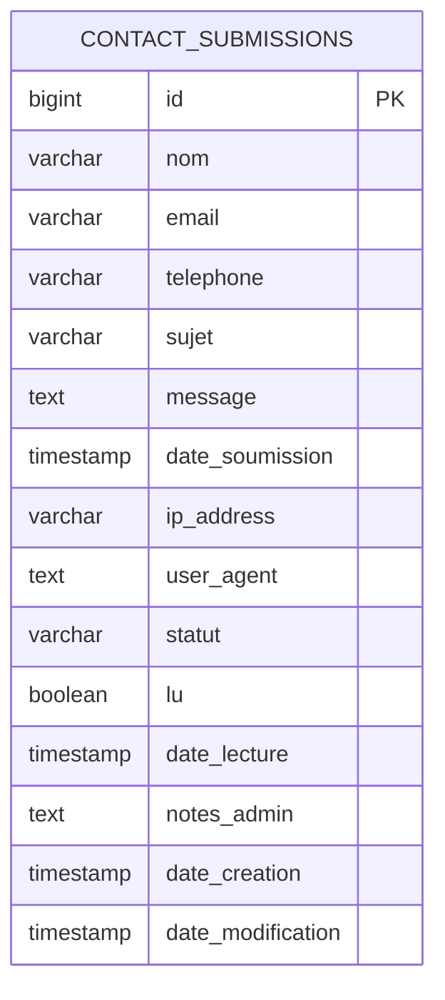
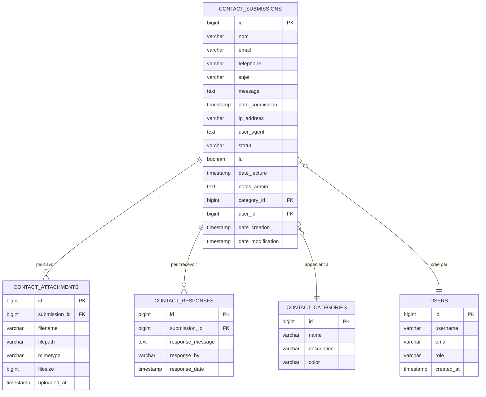

# Guide Swagger UI - Tests Complets

## Table des Matieres

1. [Acces a Swagger UI](#1-acces-a-swagger-ui)
2. [Interface Swagger - Vue d'Ensemble](#2-interface-swagger-vue-densemble)
3. [Scenarios de Test Complets](#3-scenarios-de-test-complets)
4. [Verification dans PostgreSQL](#4-verification-dans-postgresql)
5. [Diagramme de Relations](#5-diagramme-de-relations)
6. [Tests Avances](#6-tests-avances)
7. [Troubleshooting Swagger](#7-troubleshooting-swagger)

---

## 1. Acces a Swagger UI

### A. URLs d'Acces

**Depuis la VM (local)** :
```
http://localhost:8080/swagger-ui.html
```

**Depuis un autre PC (reseau local)** :
```
http://IP-DE-LA-VM:8080/swagger-ui.html
```

Exemple : `http://192.168.177.5:8080/swagger-ui.html`

**Avec Nginx (si installe)** :
```
http://IP-DE-LA-VM/swagger-ui.html
```

### B. Verification que l'API fonctionne

Avant d'utiliser Swagger, verifiez que l'API est accessible :

```bash
# Test depuis la VM
curl http://localhost:8080/api/health

# Reponse attendue
{
  "status": "UP",
  "timestamp": "2025-11-23T...",
  "database": "Connected",
  "version": "1.0.0"
}
```

---

## 2. Interface Swagger - Vue d'Ensemble

### A. Sections Principales

Quand vous ouvrez Swagger UI, vous verrez :

```
┌─────────────────────────────────────────────────┐
│  Contact Service API                            │
│  Version 1.0.0                                  │
├─────────────────────────────────────────────────┤
│  Servers                                        │
│    http://localhost:8080                        │
├─────────────────────────────────────────────────┤
│  Contact                                        │
│    POST /api/contact    Soumettre un formulaire│
│    GET  /api/contact    Informations endpoint  │
├─────────────────────────────────────────────────┤
│  Health                                         │
│    GET  /api/health     Health check           │
└─────────────────────────────────────────────────┘
```

### B. Comment Utiliser un Endpoint

1. **Cliquer** sur l'endpoint (ex: `POST /api/contact`)
2. **Cliquer** sur "Try it out"
3. **Modifier** le JSON dans le champ Request body
4. **Cliquer** sur "Execute"
5. **Consulter** la reponse (Response body, Response code)

---

## 3. Scenarios de Test Complets

### Scenario 1 : Test Minimal (Champs Obligatoires)

**Objectif** : Verifier que l'API fonctionne avec le minimum de donnees.

#### Dans Swagger UI :

1. Cliquer sur **POST /api/contact**
2. Cliquer sur **"Try it out"**
3. Remplacer le JSON par :

```json
{
  "formId": "test-minimal",
  "email": "test@example.com"
}
```

4. Cliquer sur **"Execute"**

#### Reponse Attendue : 201 Created

```json
{
  "success": true,
  "submissionId": "550e8400-e29b-41d4-a716-446655440000",
  "message": "Votre message a ete envoye avec succes",
  "timestamp": "2025-11-23T10:30:00.000+00:00"
}
```

#### Verification dans PostgreSQL :

```bash
# Se connecter a PostgreSQL
docker exec -it contact-service-db psql -U postgres -d contact_service
```

```sql
-- Verifier que le message a ete enregistre
SELECT * FROM contact_submissions 
WHERE email = 'test@example.com' 
ORDER BY date_soumission DESC 
LIMIT 1;

-- Vous devriez voir :
-- id | nom | email              | telephone | sujet | message | ...
-- 1  |     | test@example.com   |           |       |         | ...
```

---

### Scenario 2 : Test Complet (Tous les Champs)

**Objectif** : Tester avec toutes les donnees possibles.

#### Dans Swagger UI :

```json
{
  "formId": "contact-form-complet",
  "email": "jean.dupont@example.com",
  "name": "Jean Dupont",
  "message": "Bonjour, je souhaite obtenir plus d'informations sur vos services de developpement web.",
  "pageUrl": "http://localhost:3000/contact",
  "referrer": "http://localhost:3000/home",
  "data": {
    "telephone": "0612345678",
    "sujet": "Demande d'information",
    "entreprise": "Ma Societe SARL",
    "budget": "10000",
    "delai": "3 mois",
    "consentement": true
  }
}
```

#### Verification PostgreSQL :

```sql
-- Voir le message complet
SELECT 
    id,
    nom,
    email,
    sujet,
    message,
    date_soumission,
    statut,
    lu
FROM contact_submissions 
WHERE email = 'jean.dupont@example.com' 
ORDER BY date_soumission DESC 
LIMIT 1;

-- Voir les donnees supplementaires (si stockees dans une table liee)
-- Note: Dans ce projet, les "data" sont stockees dans l'email, 
-- pas dans une table separee
```

---

### Scenario 3 : Test avec Telephone et Sujet

**Objectif** : Cas d'usage courant avec telephone et sujet.

#### Dans Swagger UI :

```json
{
  "formId": "form-support",
  "email": "marie.martin@example.com",
  "name": "Marie Martin",
  "message": "J'ai un probleme avec mon compte. Je n'arrive plus a me connecter depuis hier.",
  "data": {
    "telephone": "0623456789",
    "sujet": "Support technique"
  }
}
```

#### Verification PostgreSQL :

```sql
-- Verifier le message
SELECT id, nom, email, message, date_soumission 
FROM contact_submissions 
WHERE email = 'marie.martin@example.com';

-- Compter le nombre total de messages
SELECT COUNT(*) as total_messages 
FROM contact_submissions;
```

---

### Scenario 4 : Test d'Erreur (Format Invalide)

**Objectif** : Verifier la validation des donnees.

#### Test 1 : formId invalide (caracteres speciaux)

```json
{
  "formId": "form@test#invalid",
  "email": "test@example.com"
}
```

**Reponse attendue : 400 Bad Request**

```json
{
  "timestamp": "2025-11-23T10:30:00.000+00:00",
  "status": 400,
  "error": "Bad Request",
  "message": "Le form_id ne peut contenir que des lettres, chiffres, tirets et underscores"
}
```

#### Test 2 : Email invalide

```json
{
  "formId": "test",
  "email": "email-invalide"
}
```

**Reponse attendue : 400 Bad Request**

```json
{
  "timestamp": "2025-11-23T10:30:00.000+00:00",
  "status": 400,
  "error": "Bad Request",
  "message": "Format d'email invalide"
}
```

#### Test 3 : Champ obligatoire manquant

```json
{
  "formId": "test"
}
```

**Reponse attendue : 400 Bad Request**

```json
{
  "timestamp": "2025-11-23T10:30:00.000+00:00",
  "status": 400,
  "error": "Bad Request",
  "message": "L'email est obligatoire"
}
```

---

### Scenario 5 : Test de Volume (Plusieurs Messages)

**Objectif** : Creer plusieurs messages pour tester les statistiques.

#### Envoyer 5 messages differents :

**Message 1** :
```json
{
  "formId": "form-1",
  "email": "user1@example.com",
  "name": "Utilisateur 1",
  "message": "Premier message de test"
}
```

**Message 2** :
```json
{
  "formId": "form-2",
  "email": "user2@example.com",
  "name": "Utilisateur 2",
  "message": "Deuxieme message de test"
}
```

**Message 3, 4, 5** : Variez les donnees...

#### Verification PostgreSQL - Statistiques :

```sql
-- Compter tous les messages
SELECT COUNT(*) as total FROM contact_submissions;

-- Messages par statut
SELECT statut, COUNT(*) as nombre 
FROM contact_submissions 
GROUP BY statut;

-- Messages aujourd'hui
SELECT COUNT(*) as messages_aujourdhui 
FROM contact_submissions 
WHERE date_soumission::date = CURRENT_DATE;

-- Top 5 des emails
SELECT email, COUNT(*) as nombre 
FROM contact_submissions 
GROUP BY email 
ORDER BY nombre DESC 
LIMIT 5;
```

---

## 4. Verification dans PostgreSQL

### A. Connexion Rapide

```bash
# Methode directe (RECOMMANDE)
docker exec -it contact-service-db psql -U postgres -d contact_service
```

### B. Commandes Essentielles de Verification

#### 1. Voir Tous les Messages

```sql
-- Voir les 10 derniers messages
SELECT 
    id,
    nom,
    email,
    message,
    date_soumission,
    statut,
    lu
FROM contact_submissions 
ORDER BY date_soumission DESC 
LIMIT 10;
```

#### 2. Chercher un Message Specifique

```sql
-- Par email
SELECT * FROM contact_submissions 
WHERE email = 'test@example.com';

-- Par ID
SELECT * FROM contact_submissions 
WHERE id = 1;

-- Par nom (recherche partielle)
SELECT * FROM contact_submissions 
WHERE nom LIKE '%Dupont%';
```

#### 3. Verifier les Statistiques

```sql
-- Nombre total
SELECT COUNT(*) FROM contact_submissions;

-- Par statut
SELECT statut, COUNT(*) 
FROM contact_submissions 
GROUP BY statut;

-- Messages non lus
SELECT COUNT(*) 
FROM contact_submissions 
WHERE lu = false;
```

#### 4. Voir la Structure de la Table

```sql
-- Description complete
\d+ contact_submissions

-- Liste des colonnes
\d contact_submissions
```

---

## 5. Diagramme de Relations

### A. Structure Actuelle (1 Table)

Le projet actuel utilise une **seule table** : `contact_submissions`



### B. Architecture Etendue (Multi-Tables) - Proposition

Si on voulait etendre le systeme avec plusieurs tables :



### C. Relations Detaillees

#### Relation 1 : CONTACT_SUBMISSIONS → CONTACT_ATTACHMENTS

- **Type** : One-to-Many (1:N)
- **Description** : Un message peut avoir plusieurs pieces jointes
- **Cle etrangere** : `submission_id` dans `CONTACT_ATTACHMENTS`

#### Relation 2 : CONTACT_SUBMISSIONS → CONTACT_RESPONSES

- **Type** : One-to-Many (1:N)
- **Description** : Un message peut recevoir plusieurs reponses
- **Cle etrangere** : `submission_id` dans `CONTACT_RESPONSES`

#### Relation 3 : CONTACT_SUBMISSIONS → CONTACT_CATEGORIES

- **Type** : Many-to-One (N:1)
- **Description** : Plusieurs messages appartiennent a une categorie
- **Cle etrangere** : `category_id` dans `CONTACT_SUBMISSIONS`

#### Relation 4 : CONTACT_SUBMISSIONS → USERS

- **Type** : Many-to-One (N:1)
- **Description** : Plusieurs messages peuvent etre crees par un utilisateur
- **Cle etrangere** : `user_id` dans `CONTACT_SUBMISSIONS`

### D. Script SQL pour Creer les Tables Supplementaires (Optionnel)

```sql
-- Table des pieces jointes
CREATE TABLE IF NOT EXISTS contact_attachments (
    id BIGSERIAL PRIMARY KEY,
    submission_id BIGINT NOT NULL REFERENCES contact_submissions(id) ON DELETE CASCADE,
    filename VARCHAR(255) NOT NULL,
    filepath VARCHAR(500) NOT NULL,
    mimetype VARCHAR(100),
    filesize BIGINT,
    uploaded_at TIMESTAMP DEFAULT CURRENT_TIMESTAMP
);

-- Table des reponses
CREATE TABLE IF NOT EXISTS contact_responses (
    id BIGSERIAL PRIMARY KEY,
    submission_id BIGINT NOT NULL REFERENCES contact_submissions(id) ON DELETE CASCADE,
    response_message TEXT NOT NULL,
    response_by VARCHAR(255),
    response_date TIMESTAMP DEFAULT CURRENT_TIMESTAMP
);

-- Table des categories
CREATE TABLE IF NOT EXISTS contact_categories (
    id BIGSERIAL PRIMARY KEY,
    name VARCHAR(100) NOT NULL UNIQUE,
    description TEXT,
    color VARCHAR(20)
);

-- Table des utilisateurs
CREATE TABLE IF NOT EXISTS users (
    id BIGSERIAL PRIMARY KEY,
    username VARCHAR(100) NOT NULL UNIQUE,
    email VARCHAR(255) NOT NULL UNIQUE,
    role VARCHAR(50) DEFAULT 'USER',
    created_at TIMESTAMP DEFAULT CURRENT_TIMESTAMP
);

-- Ajouter la colonne category_id a contact_submissions
ALTER TABLE contact_submissions 
ADD COLUMN IF NOT EXISTS category_id BIGINT REFERENCES contact_categories(id);

-- Ajouter la colonne user_id a contact_submissions
ALTER TABLE contact_submissions 
ADD COLUMN IF NOT EXISTS user_id BIGINT REFERENCES users(id);

-- Index pour optimiser les jointures
CREATE INDEX IF NOT EXISTS idx_attachments_submission ON contact_attachments(submission_id);
CREATE INDEX IF NOT EXISTS idx_responses_submission ON contact_responses(submission_id);
CREATE INDEX IF NOT EXISTS idx_submissions_category ON contact_submissions(category_id);
CREATE INDEX IF NOT EXISTS idx_submissions_user ON contact_submissions(user_id);
```

### E. Requetes avec Jointures (Exemple)

```sql
-- Voir un message avec toutes ses pieces jointes
SELECT 
    cs.id,
    cs.nom,
    cs.email,
    cs.message,
    ca.filename,
    ca.filesize,
    ca.uploaded_at
FROM contact_submissions cs
LEFT JOIN contact_attachments ca ON cs.id = ca.submission_id
WHERE cs.id = 1;

-- Voir un message avec toutes ses reponses
SELECT 
    cs.id,
    cs.nom,
    cs.email,
    cs.message,
    cr.response_message,
    cr.response_by,
    cr.response_date
FROM contact_submissions cs
LEFT JOIN contact_responses cr ON cs.id = cr.submission_id
WHERE cs.id = 1;

-- Statistiques par categorie
SELECT 
    cc.name as categorie,
    COUNT(cs.id) as nombre_messages
FROM contact_categories cc
LEFT JOIN contact_submissions cs ON cc.id = cs.category_id
GROUP BY cc.name
ORDER BY nombre_messages DESC;
```

---

## 6. Tests Avances

### A. Test du Health Check

**Objectif** : Verifier que l'API et la base de donnees sont operationnelles.

#### Dans Swagger UI :

1. Cliquer sur **GET /api/health**
2. Cliquer sur **"Try it out"**
3. Cliquer sur **"Execute"**

#### Reponse Attendue : 200 OK

```json
{
  "status": "UP",
  "timestamp": "2025-11-23T10:30:00.000+00:00",
  "database": "Connected",
  "version": "1.0.0"
}
```

### B. Test de l'Endpoint GET /api/contact

**Objectif** : Comprendre le message informatif du GET.

#### Dans Swagger UI :

1. Cliquer sur **GET /api/contact**
2. Cliquer sur **"Try it out"**
3. Cliquer sur **"Execute"**

#### Reponse Attendue : 405 Method Not Allowed

```json
{
  "error": "Method Not Allowed",
  "message": "Cette route accepte uniquement les requetes POST",
  "usage": {
    "method": "POST",
    "endpoint": "/api/contact",
    "contentType": "application/json",
    "requiredFields": ["formId", "email"],
    "optionalFields": ["name", "message", "pageUrl", "referrer", "data"]
  }
}
```

**Explication** : C'est une **fonctionnalite volontaire** pour guider les utilisateurs qui se trompent de methode.

### C. Test de Performance (Optionnel)

#### Envoyer 10 messages rapidement :

```bash
# Depuis la VM ou votre PC
for i in {1..10}; do
  curl -X POST http://localhost:8080/api/contact \
    -H "Content-Type: application/json" \
    -d "{\"formId\": \"perf-test-$i\", \"email\": \"user$i@example.com\", \"message\": \"Message de test $i\"}"
done
```

#### Verification PostgreSQL :

```sql
-- Compter les messages de test
SELECT COUNT(*) 
FROM contact_submissions 
WHERE email LIKE 'user%@example.com';

-- Voir le temps entre le premier et le dernier
SELECT 
    MIN(date_soumission) as premier,
    MAX(date_soumission) as dernier,
    MAX(date_soumission) - MIN(date_soumission) as duree
FROM contact_submissions 
WHERE email LIKE 'user%@example.com';
```

---

## 7. Troubleshooting Swagger

### Probleme 1 : Swagger UI ne s'affiche pas

**Symptomes** :
- Page blanche
- Erreur 404
- "Unable to render this definition"

**Solutions** :

```bash
# 1. Verifier que l'application tourne
docker compose ps

# 2. Verifier les logs
docker compose logs app | grep -i swagger

# 3. Tester l'URL alternative
http://localhost:8080/swagger-ui/index.html

# 4. Verifier l'API Docs JSON
curl http://localhost:8080/v3/api-docs
```

### Probleme 2 : Erreur CORS dans Swagger

**Symptome** : Erreur "Network Error" ou "Failed to fetch"

**Solution** :

```bash
# Editer le fichier .env
cd /home/deploy/apps/microservice-contact-service-spring-boot-2
sudo -u deploy nano .env

# Ajouter/modifier
CORS_ALLOWED_ORIGINS=*

# Redemarrer
sudo -u deploy docker compose restart
```

### Probleme 3 : Swagger execute mais aucune reponse

**Cause** : L'API ne repond pas ou est lente

**Solutions** :

```bash
# Voir les logs en temps reel
docker compose logs -f app

# Verifier la base de donnees
docker exec -it contact-service-db psql -U postgres -d contact_service -c "SELECT 1;"

# Redemarrer l'application
docker compose restart app
```

### Probleme 4 : Erreur 500 sur tous les endpoints

**Cause** : Probleme de connexion a PostgreSQL

**Solutions** :

```bash
# Verifier PostgreSQL
docker compose ps postgres

# Voir les logs PostgreSQL
docker compose logs postgres

# Redemarrer tout
docker compose down
docker compose up -d
```

---

## 8. Checklist de Test Complete

Utilisez cette checklist pour valider completement votre API :

### Tests Fonctionnels

- [ ] **Test 1** : Envoyer un message minimal (formId + email)
- [ ] **Test 2** : Envoyer un message complet (tous les champs)
- [ ] **Test 3** : Envoyer un message avec telephone et sujet
- [ ] **Test 4** : Tester avec formId invalide (doit echouer avec 400)
- [ ] **Test 5** : Tester avec email invalide (doit echouer avec 400)
- [ ] **Test 6** : Tester sans email (doit echouer avec 400)
- [ ] **Test 7** : Tester le GET /api/health (doit retourner 200)
- [ ] **Test 8** : Tester le GET /api/contact (doit retourner 405)

### Verifications PostgreSQL

- [ ] **Verif 1** : Se connecter a PostgreSQL sans erreur
- [ ] **Verif 2** : Voir la liste des tables (\dt)
- [ ] **Verif 3** : Compter les messages (SELECT COUNT(*))
- [ ] **Verif 4** : Voir les derniers messages
- [ ] **Verif 5** : Chercher un message par email
- [ ] **Verif 6** : Voir les statistiques par statut

### Tests d'Integration

- [ ] **Integration 1** : Message envoye → Present dans PostgreSQL
- [ ] **Integration 2** : Plusieurs messages → Comptage correct
- [ ] **Integration 3** : Message avec data → Donnees preservees
- [ ] **Integration 4** : Horodatage correct (date_soumission)

---

## 9. Exemples d'Utilisation Reelle

### Exemple 1 : Formulaire de Contact Simple

```json
{
  "formId": "contact-site-web",
  "email": "client@example.com",
  "name": "Jean Client",
  "message": "Bonjour, j'aimerais avoir un devis pour la creation d'un site web.",
  "data": {
    "telephone": "0612345678",
    "sujet": "Demande de devis"
  }
}
```

### Exemple 2 : Support Technique

```json
{
  "formId": "support-technique",
  "email": "user@client.com",
  "name": "Marie Utilisateur",
  "message": "Je ne peux plus acceder a mon compte depuis ce matin. Message d'erreur: 'Authentification echouee'",
  "data": {
    "telephone": "0623456789",
    "sujet": "Probleme de connexion",
    "numero_compte": "12345",
    "type_erreur": "Authentification"
  }
}
```

### Exemple 3 : Candidature

```json
{
  "formId": "candidature-spontanee",
  "email": "candidat@example.com",
  "name": "Pierre Candidat",
  "message": "Bonjour, je suis developpeur Full Stack avec 5 ans d'experience. Je serais interesse par une opportunite dans votre entreprise.",
  "data": {
    "telephone": "0698765432",
    "sujet": "Candidature spontanee",
    "poste_recherche": "Developpeur Full Stack",
    "experience": "5 ans",
    "linkedin": "https://linkedin.com/in/pierrecandidat"
  }
}
```

---

## 10. Ressources Supplementaires

### Documentation API

- **API Docs JSON** : `http://localhost:8080/v3/api-docs`
- **Swagger UI** : `http://localhost:8080/swagger-ui.html`

### Guides Complementaires

- **Guide Tests et CORS** : `07-tests-et-cors.md`
- **Guide Base de Donnees** : `08-base-de-donnees.md`
- **Guide Acces et Utilisation** : `06-acces-et-utilisation.md`

### Commandes Rapides

```bash
# Swagger UI
firefox http://localhost:8080/swagger-ui.html

# PostgreSQL
docker exec -it contact-service-db psql -U postgres -d contact_service

# Logs
docker compose logs -f app

# Health check
curl http://localhost:8080/api/health
```

---

Bon test avec Swagger UI !

