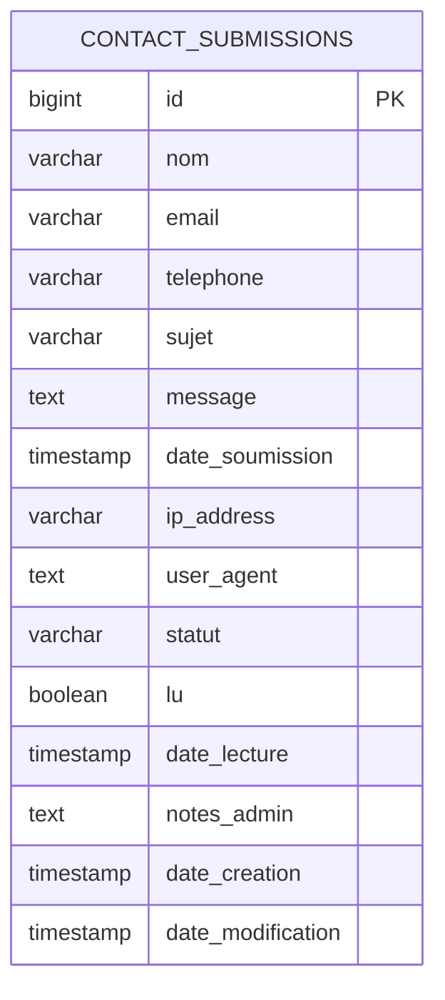
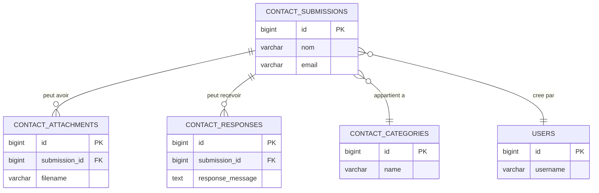

# FAQ Avancee - Questions Frequentes Techniques

## Table des Matieres

1. [Structure de la Base de Donnees](#1-structure-de-la-base-de-donnees)
2. [Multi-Sites et Multi-Domaines](#2-multi-sites-et-multi-domaines)
3. [Configuration CORS Detaillee](#3-configuration-cors-detaillee)
4. [Gestion des Formulaires](#4-gestion-des-formulaires)
5. [Exemples Concrets Multi-Colleges](#5-exemples-concrets-multi-colleges)
6. [Dashboard et Statistiques](#6-dashboard-et-statistiques)

---

## 1. Structure de la Base de Donnees

### Question : Combien de tables y a-t-il ?

**Reponse : UNE SEULE table dans le projet actuel**

```sql
-- Verifier sur votre VM
docker exec -it contact-service-db psql -U postgres -d contact_service

-- Dans psql :
\dt

-- Resultat : Vous verrez SEULEMENT
-- contact_submissions
```

### Pourquoi la Confusion avec "Deux Tables" ?

Dans le document `09-guide-swagger.md`, il y a **deux diagrammes** :

#### Diagramme 1 : ARCHITECTURE ACTUELLE (1 table)



**C'est ce qui existe VRAIMENT dans le projet !**

#### Diagramme 2 : PROPOSITION D'EVOLUTION (5 tables)



**C'est une PROPOSITION pour l'avenir, pas la realite actuelle !**

### Structure Actuelle vs Future

| Aspect | Actuel | Proposition Future |
|--------|--------|-------------------|
| **Nombre de tables** | 1 table | 5 tables |
| **Table principale** | `contact_submissions` | `contact_submissions` |
| **Pieces jointes** | Non supporte | Table `contact_attachments` |
| **Reponses** | Champ `notes_admin` | Table `contact_responses` |
| **Categories** | Via `formId` | Table `contact_categories` |
| **Utilisateurs** | Non gere | Table `users` |

### Verification Pratique

```bash
# Verifier la structure actuelle
docker exec -it contact-service-db psql -U postgres -d contact_service

# Lister les tables
\dt

# Decrire la table contact_submissions
\d contact_submissions

# Compter les lignes
SELECT COUNT(*) FROM contact_submissions;

# Voir la structure complete
\d+ contact_submissions
```

---

## 2. Multi-Sites et Multi-Domaines

### Question : Puis-je utiliser plusieurs sites avec des domaines differents ?

**Reponse : OUI, ABSOLUMENT ! C'est la force de cette architecture !**

### Exemple Concret : Deux Colleges

```
┌─────────────────────────────────────────────────┐
│     Contact Service API (Port 8080)             │
│          PostgreSQL Database                     │
│         (1 seule table: contact_submissions)    │
└────────────────────┬────────────────────────────┘
                     │
        ┌────────────┴────────────┐
        │                         │
        ▼                         ▼
┌─────────────────┐      ┌─────────────────┐
│  collegecdi.ca  │      │ collegelesex... │
│                 │      │                 │
│ - Contact       │      │ - Contact       │
│ - Inscription   │      │ - Inscription   │
│ - Info          │      │ - Info          │
│                 │      │                 │
│ formId:         │      │ formId:         │
│ - collegecdi-*  │      │ - excellents-*  │
└─────────────────┘      └─────────────────┘
```

### Comment Ca Fonctionne ?

#### Site 1 : collegecdi.ca

```javascript
// Formulaire de contact sur collegecdi.ca
const handleSubmit = async (formData) => {
  const response = await fetch('https://api.votre-serveur.com/api/contact', {
    method: 'POST',
    headers: { 'Content-Type': 'application/json' },
    body: JSON.stringify({
      formId: 'collegecdi-contact',  // Identifiant unique pour ce college
      email: formData.email,
      name: formData.name,
      message: formData.message,
      pageUrl: 'https://collegecdi.ca/contact',
      data: {
        telephone: formData.telephone,
        programme: formData.programme
      }
    })
  });
};
```

#### Site 2 : collegelesexcellents.ca

```javascript
// Formulaire de contact sur collegelesexcellents.ca
const handleSubmit = async (formData) => {
  const response = await fetch('https://api.votre-serveur.com/api/contact', {
    method: 'POST',
    headers: { 'Content-Type': 'application/json' },
    body: JSON.stringify({
      formId: 'excellents-contact',  // Identifiant different
      email: formData.email,
      name: formData.name,
      message: formData.message,
      pageUrl: 'https://collegelesexcellents.ca/contact',
      data: {
        telephone: formData.telephone,
        programme: formData.programme
      }
    })
  });
};
```

### Resultat dans PostgreSQL

Tous les messages des deux colleges sont dans **la meme table** :

```sql
-- Voir tous les messages
SELECT id, nom, email, form_id, date_soumission 
FROM contact_submissions 
ORDER BY date_soumission DESC 
LIMIT 10;
```

**Resultat** :
```
id | nom          | email              | form_id             | date_soumission
1  | Jean Dupont  | jean@example.com   | collegecdi-contact  | 2025-11-23 10:30:00
2  | Marie Martin | marie@example.com  | excellents-contact  | 2025-11-23 10:25:00
3  | Pierre Doe   | pierre@example.com | collegecdi-inscription | 2025-11-23 10:20:00
4  | Sophie L.    | sophie@example.com | excellents-info     | 2025-11-23 10:15:00
```

### Avantages de cette Approche

✅ **Un seul backend** a maintenir pour tous les colleges  
✅ **Une seule base de donnees** pour tous les messages  
✅ **Statistiques centralisees** faciles  
✅ **Couts reduits** (1 serveur au lieu de N)  
✅ **Maintenance simplifiee** (1 mise a jour au lieu de N)  

---

## 3. Configuration CORS Detaillee

### Question : Comment autoriser plusieurs domaines differents ?

**Reponse : Configurer la variable CORS_ALLOWED_ORIGINS dans le fichier .env**

### Configuration pour Deux Colleges

```bash
# Sur votre VM
cd /home/deploy/apps/microservice-contact-service-spring-boot-2
sudo -u deploy nano .env
```

#### Option 1 : Autoriser les Domaines Specifiques (PRODUCTION)

```env
# Autoriser collegecdi.ca et collegelesexcellents.ca
CORS_ALLOWED_ORIGINS=https://collegecdi.ca,https://www.collegecdi.ca,https://collegelesexcellents.ca,https://www.collegelesexcellents.ca

# Autres variables
SMTP_HOST=smtp.gmail.com
SMTP_PORT=587
SMTP_USER=votre-email@gmail.com
SMTP_PASS=votre-mot-de-passe-app
CONTACT_NOTIFICATION_EMAIL=admin@collegecdi.ca
```

#### Option 2 : Developpement + Production

```env
# Autoriser localhost pour dev + domaines pour prod
CORS_ALLOWED_ORIGINS=http://localhost:3000,http://localhost:4321,https://collegecdi.ca,https://collegelesexcellents.ca
```

#### Option 3 : Tout Autoriser (DEVELOPPEMENT UNIQUEMENT)

```env
# ATTENTION : NE JAMAIS UTILISER EN PRODUCTION !
CORS_ALLOWED_ORIGINS=*
```

### Redemarrer apres Modification

```bash
# Redemarrer l'application
sudo -u deploy docker compose restart

# Attendre 30 secondes
sleep 30

# Verifier que ca fonctionne
curl http://localhost:8080/api/health
```

### Verification CORS

```bash
# Tester depuis collegecdi.ca (simuler)
curl -X POST http://localhost:8080/api/contact \
  -H "Content-Type: application/json" \
  -H "Origin: https://collegecdi.ca" \
  -v \
  -d '{
    "formId": "collegecdi-test",
    "email": "test@collegecdi.ca"
  }'

# Chercher dans la reponse :
# < Access-Control-Allow-Origin: https://collegecdi.ca
```

### Troubleshooting CORS

#### Erreur : "has been blocked by CORS policy"

**Message complet** :
```
Access to fetch at 'https://api.example.com/api/contact' from origin 'https://collegecdi.ca' 
has been blocked by CORS policy: No 'Access-Control-Allow-Origin' header is present.
```

**Solution** :

1. Verifier que le domaine est dans `CORS_ALLOWED_ORIGINS`
2. Verifier l'orthographe exacte (avec/sans `www`)
3. Verifier le protocole (`http` vs `https`)
4. Redemarrer l'application

```bash
# Verifier la configuration actuelle
cat .env | grep CORS

# Corriger
nano .env

# Redemarrer
sudo -u deploy docker compose restart
```

---

## 4. Gestion des Formulaires

### Convention de Nommage par College

#### Collegecdi.ca

```
collegecdi-contact           # Formulaire de contact general
collegecdi-inscription       # Formulaire d'inscription
collegecdi-info              # Demande d'information
collegecdi-support           # Support technique
collegecdi-rh                # Ressources humaines
collegecdi-newsletter        # Inscription newsletter
```

#### Collegelesexcellents.ca

```
excellents-contact           # Formulaire de contact general
excellents-inscription       # Formulaire d'inscription
excellents-info              # Demande d'information
excellents-support           # Support technique
excellents-rh                # Ressources humaines
excellents-newsletter        # Inscription newsletter
```

### Exemples de Code par Type de Formulaire

#### Contact General (collegecdi.ca)

```javascript
// components/ContactForm.jsx
import React, { useState } from 'react';

function ContactFormCDI() {
  const [formData, setFormData] = useState({
    email: '',
    name: '',
    telephone: '',
    message: ''
  });

  const handleSubmit = async (e) => {
    e.preventDefault();
    
    try {
      const response = await fetch('https://api.votre-serveur.com/api/contact', {
        method: 'POST',
        headers: { 'Content-Type': 'application/json' },
        body: JSON.stringify({
          formId: 'collegecdi-contact',
          email: formData.email,
          name: formData.name,
          message: formData.message,
          pageUrl: window.location.href,
          referrer: document.referrer,
          data: {
            telephone: formData.telephone,
            source: 'Site Web CDI'
          }
        })
      });
      
      const data = await response.json();
      if (data.success) {
        alert('Message envoye avec succes !');
        setFormData({ email: '', name: '', telephone: '', message: '' });
      }
    } catch (error) {
      console.error('Erreur:', error);
      alert('Erreur lors de l\'envoi');
    }
  };

  return (
    <form onSubmit={handleSubmit}>
      <input
        type="email"
        value={formData.email}
        onChange={(e) => setFormData({...formData, email: e.target.value})}
        placeholder="Email"
        required
      />
      <input
        type="text"
        value={formData.name}
        onChange={(e) => setFormData({...formData, name: e.target.value})}
        placeholder="Nom complet"
      />
      <input
        type="tel"
        value={formData.telephone}
        onChange={(e) => setFormData({...formData, telephone: e.target.value})}
        placeholder="Telephone"
      />
      <textarea
        value={formData.message}
        onChange={(e) => setFormData({...formData, message: e.target.value})}
        placeholder="Votre message"
        rows="5"
      />
      <button type="submit">Envoyer</button>
    </form>
  );
}

export default ContactFormCDI;
```

#### Inscription Programme (collegelesexcellents.ca)

```javascript
// components/InscriptionForm.jsx
import React, { useState } from 'react';

function InscriptionFormExcellents() {
  const [formData, setFormData] = useState({
    email: '',
    name: '',
    telephone: '',
    programme: '',
    session: ''
  });

  const handleSubmit = async (e) => {
    e.preventDefault();
    
    try {
      const response = await fetch('https://api.votre-serveur.com/api/contact', {
        method: 'POST',
        headers: { 'Content-Type': 'application/json' },
        body: JSON.stringify({
          formId: 'excellents-inscription',
          email: formData.email,
          name: formData.name,
          message: `Demande d'inscription - Programme: ${formData.programme}, Session: ${formData.session}`,
          pageUrl: window.location.href,
          data: {
            telephone: formData.telephone,
            programme: formData.programme,
            session: formData.session,
            type: 'inscription',
            source: 'Site Web Les Excellents'
          }
        })
      });
      
      const data = await response.json();
      if (data.success) {
        alert('Demande d\'inscription envoyee ! Nous vous contacterons bientot.');
        setFormData({ email: '', name: '', telephone: '', programme: '', session: '' });
      }
    } catch (error) {
      console.error('Erreur:', error);
      alert('Erreur lors de l\'envoi');
    }
  };

  return (
    <form onSubmit={handleSubmit}>
      <input
        type="email"
        value={formData.email}
        onChange={(e) => setFormData({...formData, email: e.target.value})}
        placeholder="Email"
        required
      />
      <input
        type="text"
        value={formData.name}
        onChange={(e) => setFormData({...formData, name: e.target.value})}
        placeholder="Nom complet"
        required
      />
      <input
        type="tel"
        value={formData.telephone}
        onChange={(e) => setFormData({...formData, telephone: e.target.value})}
        placeholder="Telephone"
        required
      />
      <select
        value={formData.programme}
        onChange={(e) => setFormData({...formData, programme: e.target.value})}
        required
      >
        <option value="">Choisir un programme</option>
        <option value="informatique">Techniques de l'informatique</option>
        <option value="comptabilite">Techniques de comptabilite</option>
        <option value="gestion">Gestion de commerce</option>
      </select>
      <select
        value={formData.session}
        onChange={(e) => setFormData({...formData, session: e.target.value})}
        required
      >
        <option value="">Choisir une session</option>
        <option value="hiver-2026">Hiver 2026</option>
        <option value="automne-2026">Automne 2026</option>
      </select>
      <button type="submit">Soumettre ma demande</button>
    </form>
  );
}

export default InscriptionFormExcellents;
```

---

## 5. Exemples Concrets Multi-Colleges

### Requetes SQL pour Separer les Colleges

#### Voir seulement les messages de collegecdi.ca

```sql
SELECT * FROM contact_submissions 
WHERE form_id LIKE 'collegecdi-%'
ORDER BY date_soumission DESC;
```

#### Voir seulement les messages de collegelesexcellents.ca

```sql
SELECT * FROM contact_submissions 
WHERE form_id LIKE 'excellents-%'
ORDER BY date_soumission DESC;
```

#### Compter par college

```sql
SELECT 
    CASE 
        WHEN form_id LIKE 'collegecdi-%' THEN 'College CDI'
        WHEN form_id LIKE 'excellents-%' THEN 'College Les Excellents'
        ELSE 'Autre'
    END as college,
    COUNT(*) as nombre_messages
FROM contact_submissions
GROUP BY college;
```

**Resultat** :
```
college                  | nombre_messages
College CDI             | 150
College Les Excellents  | 85
```

#### Compter par type de formulaire

```sql
SELECT 
    CASE 
        WHEN form_id LIKE '%-contact' THEN 'Contact'
        WHEN form_id LIKE '%-inscription' THEN 'Inscription'
        WHEN form_id LIKE '%-info' THEN 'Information'
        WHEN form_id LIKE '%-support' THEN 'Support'
        ELSE 'Autre'
    END as type_formulaire,
    COUNT(*) as nombre
FROM contact_submissions
GROUP BY type_formulaire
ORDER BY nombre DESC;
```

**Resultat** :
```
type_formulaire | nombre
Inscription     | 120
Contact         | 80
Information     | 25
Support         | 10
```

---

## 6. Dashboard et Statistiques

### Dashboard Global (Tous les Colleges)

```sql
-- Vue d'ensemble complete
SELECT 
    -- Identifier le college
    CASE 
        WHEN form_id LIKE 'collegecdi-%' THEN 'College CDI'
        WHEN form_id LIKE 'excellents-%' THEN 'College Les Excellents'
        ELSE 'Autre'
    END as college,
    
    -- Statistiques globales
    COUNT(*) as total_messages,
    COUNT(*) FILTER (WHERE lu = false) as non_lus,
    COUNT(*) FILTER (WHERE statut = 'NOUVEAU') as nouveaux,
    COUNT(*) FILTER (WHERE statut = 'TRAITE') as traites,
    
    -- Statistiques temporelles
    COUNT(*) FILTER (WHERE date_soumission::date = CURRENT_DATE) as aujourdhui,
    COUNT(*) FILTER (WHERE date_soumission >= CURRENT_DATE - INTERVAL '7 days') as cette_semaine,
    COUNT(*) FILTER (WHERE date_soumission >= CURRENT_DATE - INTERVAL '30 days') as ce_mois,
    
    -- Dernier message
    MAX(date_soumission) as dernier_message
    
FROM contact_submissions
WHERE form_id LIKE 'collegecdi-%' OR form_id LIKE 'excellents-%'
GROUP BY college;
```

**Resultat** :
```
college     | total | non_lus | nouveaux | traites | aujourdhui | cette_semaine | ce_mois | dernier_message
CDI         | 150   | 12      | 8        | 142     | 5          | 35            | 150     | 2025-11-23 10:30
Excellents  | 85    | 7       | 4        | 81      | 3          | 20            | 85      | 2025-11-23 10:25
```

### Dashboard par Type de Formulaire

```sql
-- Statistiques detaillees par type
SELECT 
    -- Extraire le college et le type
    SPLIT_PART(form_id, '-', 1) as college,
    SPLIT_PART(form_id, '-', 2) as type_formulaire,
    
    -- Compter
    COUNT(*) as nombre,
    COUNT(*) FILTER (WHERE lu = false) as non_lus,
    
    -- Dernier message
    MAX(date_soumission) as dernier
    
FROM contact_submissions
WHERE form_id ~ '^(collegecdi|excellents)-'
GROUP BY college, type_formulaire
ORDER BY college, nombre DESC;
```

**Resultat** :
```
college     | type_formulaire | nombre | non_lus | dernier
collegecdi  | inscription     | 75     | 5       | 2025-11-23 10:30
collegecdi  | contact         | 50     | 4       | 2025-11-23 10:25
collegecdi  | info            | 20     | 2       | 2025-11-23 10:20
excellents  | inscription     | 45     | 3       | 2025-11-23 10:15
excellents  | contact         | 30     | 3       | 2025-11-23 10:10
excellents  | info            | 10     | 1       | 2025-11-23 10:05
```

### Script de Rapport Hebdomadaire

```sql
-- Rapport hebdomadaire par college
SELECT 
    date_soumission::date as jour,
    
    COUNT(*) FILTER (WHERE form_id LIKE 'collegecdi-%') as cdi,
    COUNT(*) FILTER (WHERE form_id LIKE 'excellents-%') as excellents,
    
    COUNT(*) as total
    
FROM contact_submissions
WHERE date_soumission >= CURRENT_DATE - INTERVAL '7 days'
GROUP BY jour
ORDER BY jour DESC;
```

**Resultat** :
```
jour        | cdi | excellents | total
2025-11-23  | 5   | 3          | 8
2025-11-22  | 7   | 4          | 11
2025-11-21  | 6   | 2          | 8
2025-11-20  | 4   | 3          | 7
2025-11-19  | 8   | 5          | 13
2025-11-18  | 3   | 2          | 5
2025-11-17  | 2   | 1          | 3
```

---

## 7. Recapitulatif

### Points Cles

✅ **Une seule table** : `contact_submissions` (pas deux !)  
✅ **Multi-domaines** : OUI, ca fonctionne parfaitement  
✅ **Configuration CORS** : Ajouter tous les domaines dans `.env`  
✅ **Identification** : Via le champ `formId`  
✅ **Statistiques** : Faciles avec des requetes SQL  

### Architecture

```
1 API + 1 Table + N Sites = Solution Complete
```

### Pour Ajouter un Nouveau College

1. **Ajouter le domaine dans CORS** :
   ```env
   CORS_ALLOWED_ORIGINS=...,https://nouveaucollege.ca
   ```

2. **Utiliser un nouveau prefix `formId`** :
   ```javascript
   { "formId": "nouveaucollege-contact", ... }
   ```

3. **C'est tout !** Aucune modification du backend necessaire.

---

Vous avez maintenant toutes les reponses pour gerer plusieurs colleges avec une seule API !

